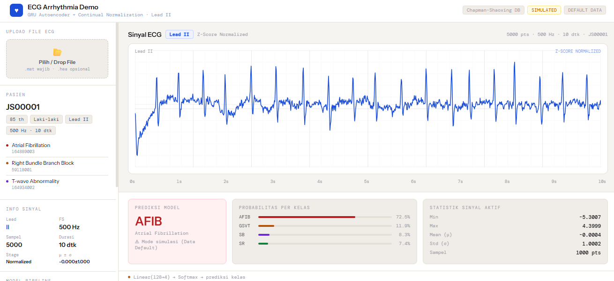

# Klasifikasi Arritmia Menggunakan GRU-CN Autoencoder

Repository ini berisi implementasi penelitian klasifikasi sinyal Electrocardiogram (ECG) menggunakan **Gated Recurrent Unit (GRU)** dengan **Continual Normalization (CN)** dan pendekatan **Autoencoder**. Model dikembangkan menggunakan dataset Chapman-Shaoxing ECG untuk mengklasifikasikan empat jenis irama jantung.

## 🧠 Arsitektur Model

Model menggunakan pendekatan **Two-Stage Learning**, yaitu:

### 1. Pretraining
- GRU Autoencoder
- Unsupervised Learning untuk mempelajari representasi fitur sinyal ECG

### 2. Fine-tuning
- Encoder hasil pretraining digunakan sebagai **feature extractor**
- Menerapkan **Continual Normalization (CN)**
- Fully Connected Layer untuk melakukan klasifikasi empat kelas aritmia

## 🌐 Live Demo

Coba aplikasi secara langsung melalui GitHub Pages:

https://athyzr.github.io/GRU_ContinualNormalization/
> **Note:** Live demo hanya menampilkan simulasi hasil prediksi. Untuk menjalankan inferensi menggunakan model GRU pada file ECG asli, silakan menjalankan proyek secara lokal.

## 📊 Hasil Penelitian

| Metric | Hasil |
|--------|-------|
| Accuracy | **92.57%** |
| Macro F1-Score | **0.9181** |
| Macro AUC | **99.00%** |

## 📂 Struktur Folder

```text
models/            # Arsitektur GRU-CN dan Autoencoder
scripts/           # Script pelatihan model
utils/             # Fungsi preprocessing dan evaluasi
data/processed/    # Dataset yang telah diproses
```
## 📥 Dataset

Repository ini tidak menyertakan dataset mentah karena ukurannya cukup besar.

Dataset dapat diunduh melalui PhysioNet:

https://physionet.org/content/ecg-arrhythmia/1.0.0/

Setelah mengunduh, letakkan dataset pada folder `data/raw/` sebelum menjalankan proses preprocessing dan pelatihan model.

## 🛠️ Cara Menjalankan

Install dependensi:

```bash
pip install -r requirements.txt
```

Jalankan proses pelatihan:

```bash
python scripts/train_gru_ae_cn_gn.py
```

## 📷 Tampilan Website

<p align="center">
  
</p>
